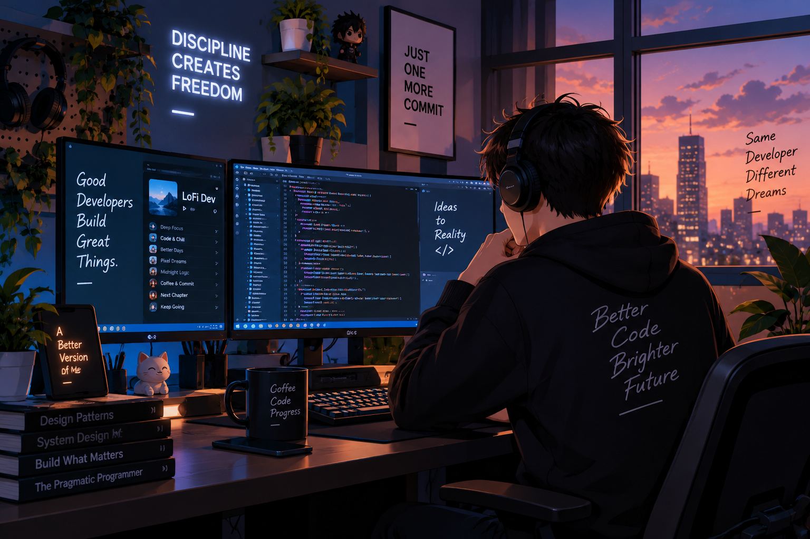

# Hi, I'm Isul Alifajri 👋

I'm a Software Developer interested in building web applications and backend systems.

## 🚀 About Me

- 💻 Full-Stack Developer working with PHP, Laravel, Livewire, Yii2, Golang, CI3, VueJS, MySQL, PostgreSQL and SQLite
- 🛠️ Developing, maintaining, and improving web applications
- 🐛 Bug fixing, troubleshooting, and performance optimization
- ✨ Implementing new features and improving user experience
- 🌱 Always learning and exploring new technologies

## 🛠️ My Skills

## 📫 Connect With Me

- GitHub: [isulalifajri](https://github.com/isulalifajri)
- LinkedIn: [isulalifajri](https://www.linkedin.com/in/isul-alifajri-128b6b245/)
